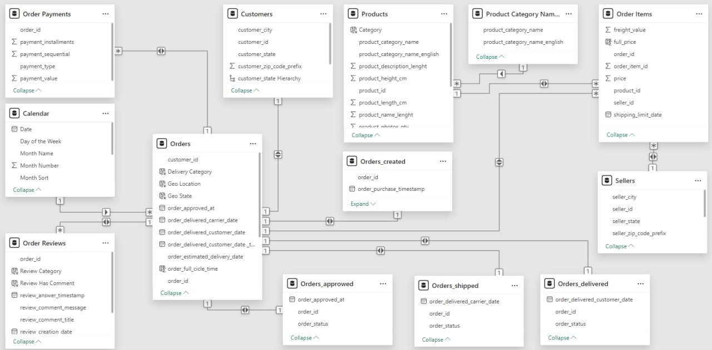

# Data-Driven Marketplace Sales Analytics — Power BI Dashboard

The project explores **e-commerce marketplace performance**, focusing on **sales**, **logistics**, **payments**, and **customer experience** based on real transactional data.  
It demonstrates the complete analytical workflow in **Power BI** — from data modeling and transformation to DAX logic and interactive visualization design.

---

## Project Purpose

The goal of this project was to build a **fully functional analytical dashboard** that:
1. Integrates multiple Olist datasets into a unified analytical model  
2. Visualizes key performance indicators (KPIs) across sales, logistics, payments, and customer reviews  
3. Enables dynamic, data-driven insights for marketplace operations and performance evaluation  
4. Demonstrates applied Power BI skills — from data preparation and modeling to DAX development and UX/UI storytelling   

---

## Dataset Source

This project is based on the open dataset published by **Olist**, the largest Brazilian online marketplace.  
It contains real anonymized data from thousands of customer orders, covering multiple stages of the sales process — from order placement to delivery and customer review.

**Data sources**: [Brazilian E-Commerce Public Dataset by Olist (Kaggle)](https://www.kaggle.com/datasets/olistbr/brazilian-ecommerce)

---

## Dataset Overview

- **Scope:** ~100K completed and in-progress orders between 2016–2018  
- **Data tables used:** orders, order_items, payments, reviews, customers, sellers, products, geolocation, and a custom date table  
- **File format:** CSV  
- **Domain:** Marketplace e-commerce platform  

---

## Data Model Overview

The Power BI data model was built using a **star schema** structure centered around the `Orders` table.  
Key relationships were created based on unique identifiers such as `order_id`, `customer_id`, `product_id`, and `seller_id`, ensuring accurate aggregation across multiple tables.  
All relationships were set with proper cardinality (`one-to-many`, `many-to-one`, and `one-to-one`) to maintain data integrity and avoid calculation duplication.  

Additionally, a **custom Calendar table** and several **supporting measures and switching mechanisms** were implemented to enable time intelligence, year-over-year comparisons, and dynamic filtering.  *(Details about DAX metrics and calculation logic are provided in a separate section.)*

---

## Dashboard Structure

| Page | Focus | Key Insights |
|------|--------|--------------|
| **Sales** | Revenue, conversion, pipeline, average check | Tracks total revenue, open deals, and funnel performance with category-level insights |
| **Logistics** | Delivery timeliness and operational cost | Monitors on-time delivery rates, delivery delays, and overall logistics efficiency |
| **Payments** | Payment distribution and transaction volume | Analyzes payment types, installment usage, and their impact on revenue streams |
| **Reviews** | Customer satisfaction and feedback quality | Evaluates customer experience through review scores and delivery satisfaction patterns |

---

## Tools & Techniques

- **Power BI Desktop** — main analytical and visualization tool  
- **Power Query** — for data transformation, cleaning, and table merging  
- **DAX (Data Analysis Expressions)** — for custom KPIs, dynamic filters, and comparison metrics  
- **UX/UI Design** — for consistent navigation, color palette, and data storytelling flow  

---

## Live Dashboard

[View Interactive Dashboard on Power BI Service](https://app.powerbi.com/view?r=eyJrIjoiNjRjMTc4N2YtY2ZmYS00ZjBhLTlhN2ItY2FkMjAwNzdmZjBkIiwidCI6ImRmODY3OWNkLWE4MGUtNDVkOC05OWFjLWM4M2VkN2ZmOTVhMCJ9&pageName=28666b125641e7adaacd)  

---

## Who This Project Benefits

**For Business Stakeholders:**  
- Understand marketplace sales dynamics and conversion performance  
- Monitor delivery quality and cost efficiency in real time  
- Identify customer satisfaction drivers and improvement areas  

**For Data Analysts & BI Professionals:**  
- Example of advanced data modeling and UX storytelling in Power BI  
- Practical implementation of DAX-based KPI logic  
- Demonstration of professional layout, color consistency, and interactivity  

---

## License

This project is released under the [MIT License](LICENSE).  
You are free to use, modify, and distribute it with attribution to the author.

---

**Author:**  
**Olena Lytvynenko**  
_Data & BI Analyst_  
Power BI | SQL | Python | Data Modeling | UX Storytelling
