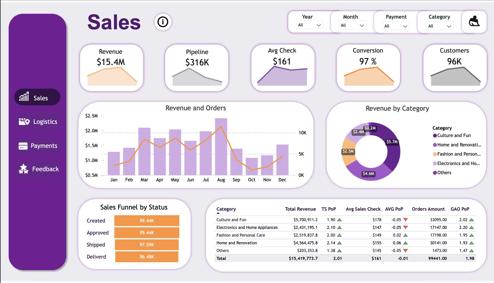
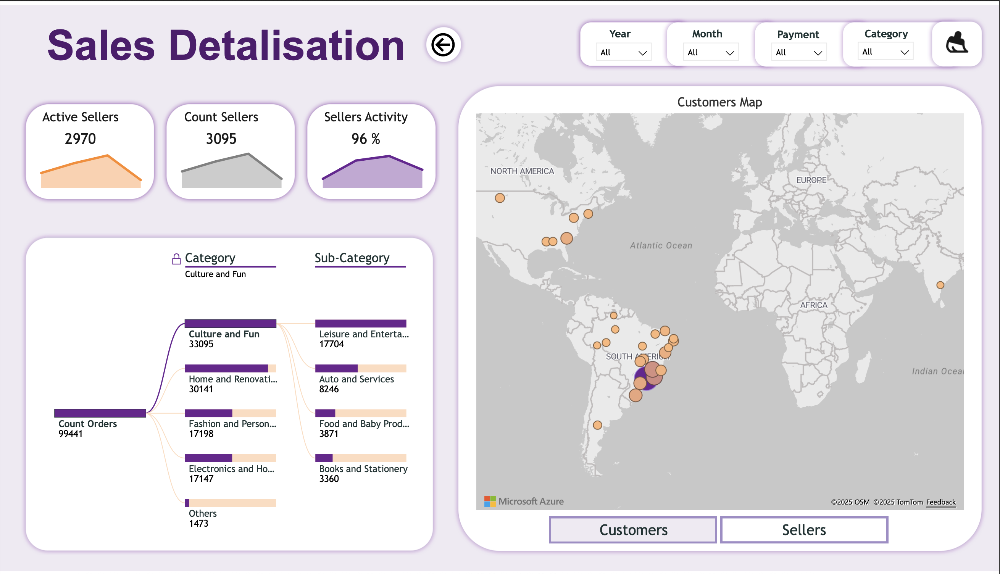
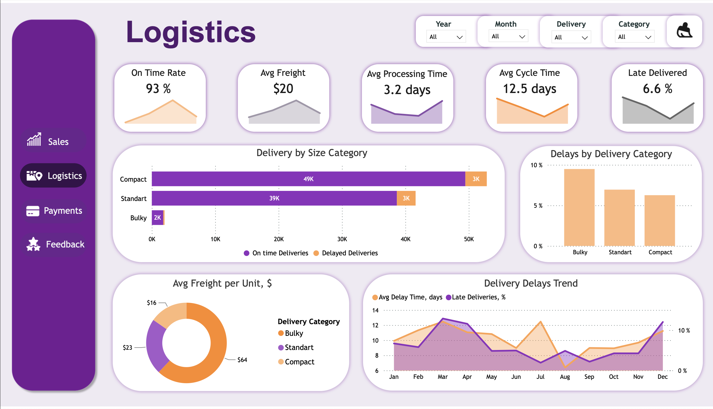
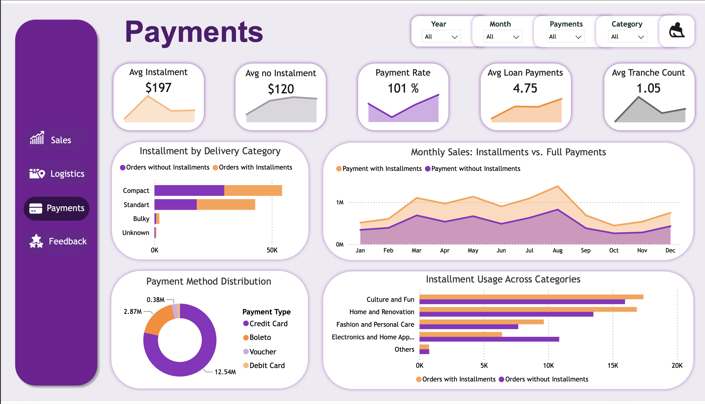
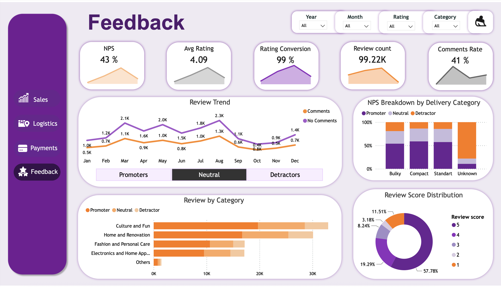

# Data-Driven Marketplace Sales Analytics — Dashboard Overview

This section provides a detailed explanation of the Power BI dashboard structure, DAX logic, and interactive functionality.  
The analytical solution covers five analytical pages — **Sales Overview**, **Sales Detailisation**, **Logistics**, **Payments**, and **Reviews** — each focusing on a specific business dimension of the e-commerce marketplace.

---

## 1.1 Sales Overview

**Purpose**  
Provide a high-level summary of marketplace performance and sales conversion dynamics.

**Main Components**
- KPI cards: Revenue, Pipeline Value, Average Check, Conversion Rate, Active Customers  
- Gradient Sales Funnel showing the order lifecycle (Created → Confirmed → Shipped → Delivered)  
- Revenue by Category  
- Orders Over Time with YoY comparison  
- Filters by Date, Category, and Payment Type  

**Example DAX**
```DAX
Revenue = SUM('order_payments'[payment_value])

Sales =
CALCULATE(
    DISTINCTCOUNT('orders'[order_id]),
    'orders'[order_status] = "delivered"
)

Leads =
CALCULATE(
    DISTINCTCOUNT('orders'[order_id]),
    'orders'[order_status] <> "delivered"
)

Conversion Rate = DIVIDE([Sales], [Leads],0)

Average Check = DIVIDE([Revenue], [Sales],0)

Pipeline Value =
CALCULATE(
    SUM('order_items'[price]),
    'orders'[order_status] <> "delivered"
)
```

**Notes**
-	The page identifies bottlenecks and growth opportunities across periods and product categories.
-	All visuals are synchronized through the calendar and cross-filtering across components.



---

## 1.2. Sales Detailisation

**Purpose**  
Drill down into marketplace structure, seller and customer activity, and product category composition.

**Main Components**
- KPI cards: Active Sellers, Total Sellers, Sellers Activity Rate  
- Switch button (bookmark) to toggle the map context: **Customers ↔ Sellers**  
- Customers/Sellers Map visualizing the geographic distribution of marketplace participants  
- Category Detail Tree built via custom DAX grouping logic (Category → Sub-Category → Count of Orders)  

**Example DAX**
```DAX
Active Sellers =
CALCULATE(
    DISTINCTCOUNT('sellers'[seller_id]),
    FILTER('orders', 'orders'[order_status] = "delivered")
)

Total Sellers = DISTINCTCOUNT('sellers'[seller_id])

Seller Activity Rate = DIVIDE([Active Sellers], [Total Sellers], 0)

Product Category Group =
SWITCH (
    TRUE(),
    'products'[product_category_name_english] IN {"toys","sports_leisure","baby"}, "Culture and Fun",
    'products'[product_category_name_english] IN {"furniture_decor","housewares"}, "Home and Renovation",
    'products'[product_category_name_english] IN {"health_beauty","perfumery","makeup"}, "Fashion and Personal Care",
    'products'[product_category_name_english] IN {"computers_accessories","electronics"}, "Electronics and Home Tech",
    "Others"
)
```

**Notes**
-	The page supports detailed exploration of seller and customer activity across locations.
-	The switcher allows switching between customer and seller geographic views.
- The hierarchical category tree visualizes product composition using DAX grouping logic.



---

## 2. Logistics  

**Purpose**  
Evaluate delivery performance, operational efficiency, and cost management across the logistics chain.

**Main Components**
- KPI cards: On-Time Delivery Rate, Average Processing Time, Average Delivery Time, Cost per Unit  
- Geo Map displaying delivery density and regional performance  
- Line chart comparing Estimated vs. Actual Delivery Time  
- Table summarizing logistics metrics by carrier and region  

**Example DAX**
```DAX
Total Deliveries =
CALCULATE(
    DISTINCTCOUNT('orders'[order_id]),
    NOT ISBLANK('orders'[order_delivered_customer_date])
)

Delivered on Time =
CALCULATE(
    DISTINCTCOUNT('orders'[order_id]),
    'orders'[order_delivered_customer_date] <= 'orders'[order_estimated_delivery_date]
)

On-Time Delivery Rate = DIVIDE([Delivered on Time], [Total Deliveries], 0)

Average Processing Time (days) =
AVERAGEX(
    FILTER(
        'orders',
        NOT ISBLANK('orders'[order_approved_at])
        && NOT ISBLANK('orders'[order_delivered_carrier_date])
    ),
    DATEDIFF(
        'orders'[order_approved_at],
        'orders'[order_delivered_carrier_date],
        DAY
    )
)

Average Delivery Time (days) =
AVERAGEX(
    FILTER(
        'orders',
        NOT ISBLANK('orders'[order_delivered_carrier_date])
        && NOT ISBLANK('orders'[order_delivered_customer_date])
    ),
    DATEDIFF(
        'orders'[order_delivered_carrier_date],
        'orders'[order_delivered_customer_date],
        DAY
    )
)

Cost per Unit =
DIVIDE(
    SUM('order_items'[freight_value]),
    COUNT('order_items'[order_id]),
    0
)
```

**Notes**
- The page evaluates the full logistics cycle, from order confirmation to final delivery.
-	KPIs highlight delivery accuracy, speed, and cost efficiency.
-	The visual design helps identify delayed shipments and high-cost regions for optimization.

  

---

## 3. Payments  

**Purpose**  
Analyze customer payment behavior, transaction structure, and revenue distribution across different payment methods.

**Main Components**
- KPI cards: Total Payments, Average Payment per Order, Installment Share  
- Charts showing payment type distribution and installment frequency  
- Time-series chart for payment activity by month  
- Table summarizing order-level payment details  

**Example DAX**
```DAX
Total Payments = SUM('order_payments'[payment_value])

Distinct Orders (Payments) =
DISTINCTCOUNT('order_payments'[order_id])

Average Payment per Order =
DIVIDE([Total Payments], [Distinct Orders (Payments)], 0)

Installment Share =
DIVIDE(
    CALCULATE(
        COUNTROWS('order_payments'),
        'order_payments'[payment_installments] > 1
    ),
    COUNTROWS('order_payments'),
    0
)
```

**Notes**
-	The page tracks financial flow across all payment methods.
-	KPIs allow analyzing installment behavior and its effect on liquidity.
-	Helps identify dominant payment preferences and evaluate customer purchasing behavior.

  

---

## 4. Reviews  

**Purpose**  
Measure customer satisfaction and evaluate the relationship between feedback quality and delivery performance.

**Main Components**
- KPI cards: Average Review Score, Total Review Count, Response Rate  
- Bar chart of review distribution by rating (1–5)  
- Line chart of average rating over time  
- Correlation view connecting delivery timeliness with review outcomes  

**Example DAX**
```DAX
Average Review Score =
AVERAGE('order_reviews'[review_score])

Total Reviews =
COUNTROWS('order_reviews')

Response Rate =
DIVIDE(
    CALCULATE(
        COUNTROWS('order_reviews'),
        NOT ISBLANK('order_reviews'[review_answer_timestamp])
    ),
    [Total Reviews],
    0
)

Negative Feedback Share =
DIVIDE(
    CALCULATE(
        COUNTROWS('order_reviews'),
        'order_reviews'[review_score] <= 2
    ),
    [Total Reviews],
    0
)
```

**Notes**
-	This page tracks customer satisfaction over time and detects patterns in negative feedback.
-	Correlating review scores with delivery data helps identify service quality bottlenecks.
-	Insights from this page guide improvements in logistics and communication.

 

---

## 5. Functional Highlights  

- Data Model: star schema centered on the Orders table, with properly defined cardinalities (one-to-many, many-to-one, one-to-one).  
- Calendar Table: enables time intelligence, YoY comparisons, and dynamic filtering.  
- Content Switching: implemented via bookmarks and measures (e.g., Customers ↔ Sellers).  
- Cross-Filtering: all visuals are fully synchronized for contextual exploration.  
- Unified Theme: consistent layout, typography, and color palette across all pages.  

---

## 6. Summary  

The dashboard provides an integrated analytical view of marketplace performance across sales, logistics, payments, and customer satisfaction.  
It demonstrates the full Power BI skill set: advanced data modeling, DAX formula development, interaction design, and professional storytelling for decision-making.
